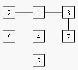

## Balancing Act 
> POJ - 1655

### Description
Consider a tree T with N (1 <= N <= 20,000) nodes numbered 1...N. Deleting any node from the tree yields a forest: a collection of one or more trees. Define the balance of a node to be the size of the largest tree in the forest T created by deleting that node from T. 
For example, consider the tree: 



Deleting node 4 yields two trees whose member nodes are {5} and {1,2,3,6,7}. The larger of these two trees has five nodes, thus the balance of node 4 is five. Deleting node 1 yields a forest of three trees of equal size: {2,6}, {3,7}, and {4,5}. Each of these trees has two nodes, so the balance of node 1 is two. 

For each input tree, calculate the node that has the minimum balance. If multiple nodes have equal balance, output the one with the lowest number. 

### Input
The first line of input contains a single integer t (1 <= t <= 20), the number of test cases. The first line of each test case contains an integer N (1 <= N <= 20,000), the number of congruence. The next N-1 lines each contains two space-separated node numbers that are the endpoints of an edge in the tree. No edge will be listed twice, and all edges will be listed.

### Output
For each test case, print a line containing two integers, the number of the node with minimum balance and the balance of that node.

### Sample Input
1  
7  
2 6  
1 2  
1 4  
4 5  
3 7  
3 1  

### Sample Output
1 2  

### 问题分析

### 错误记录
1. balance 数组没有初始化，多 case 时导致错误。

### Code
```cpp
#include<cstdio>
#include<cstring>
#include<algorithm>

using namespace std;

const int MAX = 2e4+5;

int head[MAX];
struct Edge {
    int to, w, next;
} edge[MAX<<1];
int size[MAX];
int balance[MAX];
int tot = 0;
int n = 0;

void init() {
    tot = 0;
    memset(balance, 0, sizeof(balance));
    memset(head, -1, sizeof(head));
}

void add(int u, int v, int w) {
    edge[tot].to = v;
    edge[tot].w  = w;
    edge[tot].next = head[u];
    head[u] = tot++;
}


void dfs(int u, int parent) {
    size[u] = 1;
    for (int i = head[u]; -1 != i; i = edge[i].next) {
        int v = edge[i].to;
        if (v == parent) {
            continue;
        }
        dfs(v, u);
        size[u] += size[v];
        balance[u] = max(size[v], balance[u]);
    }
    balance[u] = max(balance[u], n - size[u]);
}


int main() {
    int T;
    scanf("%d", &T);
    while (T--) {
        init();
        scanf("%d", &n);
        int a, b;
        for (int i = 1; i < n; i++) {
            scanf("%d %d", &a, &b);
            add(a, b, 1);
            add(b, a, 1);
        }        
        
        dfs(1, -1);
        int tmp = n, node = 1;
        for (int i = 1; i <= n; i++) {
            if (balance[i] < tmp) {
                tmp = balance[i];
                node = i;
            }
        }
        printf("%d %d\n", node, tmp);
    }
    return 0;
}
```