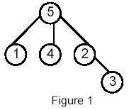

## Closest Common Ancestors 
> POJ 1470

### Description
Write a program that takes as input a rooted tree and a list of pairs of vertices. For each pair (u,v) the program determines the closest common ancestor of u and v in the tree. The closest common ancestor of two nodes u and v is the node w that is an ancestor of both u and v and has the greatest depth in the tree. A node can be its own ancestor (for example in Figure 1 the ancestors of node 2 are 2 and 5)

### Input
The data set, which is read from a the std input, starts with the tree description, in the form: 

nr_of_vertices 
vertex:(nr_of_successors) successor1 successor2 ... successorn 
... 
where vertices are represented as integers from 1 to n ( n <= 900 ). The tree description is followed by a list of pairs of vertices, in the form: 
nr_of_pairs 
(u v) (x y) ... 

The input file contents several data sets (at least one). 
Note that white-spaces (tabs, spaces and line breaks) can be used freely in the input.

### Output
For each common ancestor the program prints the ancestor and the number of pair for which it is an ancestor. The results are printed on the standard output on separate lines, in to the ascending order of the vertices, in the format: ancestor:times 
For example, for the following tree: 


### Sample Input
5  
5:(3) 1 4 2  
1:(0)  
4:(0)  
2:(1) 3  
3:(0)  
6  
(1 5) (1 4) (4 2)  
      (2 3)  
(1 3) (4 3)  

### Sample Output
2:1  
5:5  

### Code
```cpp
#include<cstdio>
#include<cstring>
#include<algorithm>

using namespace std;

const int MAX = 900+5;

int head[MAX];
struct Edge {
    int to, w, next;
} edge[MAX];
int tot = 0;
int size[MAX], son[MAX], fa[MAX], top[MAX], dep[MAX], vis[MAX], res[MAX];

void init() {
    memset(head, -1, sizeof(head));
    memset(res, 0, sizeof(res));
    memset(vis, 0, sizeof(vis));
    tot = 0;
}

void add(int u, int v, int w) {
    edge[tot].to = v;
    edge[tot].w  = w;
    edge[tot].next = head[u];
    head[u] = tot++;
}

void dfs1(int u, int parent, int depth) {
    dep[u]  = depth;
    size[u] = 1;
    fa[u]   = parent;
    son[u]  = -1;
    for (int i = head[u]; -1 != i; i = edge[i].next) {
        int v = edge[i].to;
        if (v == parent) {
            continue;
        }
        dfs1(v, u, depth+1);
        size[u] += size[v];
        if (-1 == son[u] || size[v] > size[son[u]]) {
            son[u] = v;
        }
    }
}

void dfs2(int u, int tp) {
    top[u] = tp;
    if (son[u] == -1) {
        return;
    }
    dfs2(son[u], tp);
    for (int i = head[u]; -1 != i; i = edge[i].next) {
        int v = edge[i].to;
        if (v != son[u] && v != fa[u]) {
            dfs2(v, v);
        }
    }
}

int lca(int x, int y) {
    while(top[x] != top[y]) {
        if (dep[top[x]] > dep[top[y]]) {
            x = fa[top[x]];
        } else {
            y = fa[top[y]];
        }
    }
    return dep[x] > dep[y] ? y : x;
}


int main() {
    int num;
    while (~scanf("%d", &num)) {
        init();
        for (int i = 1; i <= num; i++) {
            int u, count, v;
            scanf("%d:(%d)", &u, &count);
            while (count--) {
                scanf("%d", &v);
                vis[v] = 1;
                add(u, v, 1);
            }
        }
        int root = 0;
        for (int i = 1; i <= num; i++) {
            if (!vis[i]) {
                root = i;
                break;
            }
        }

        dfs1(root, -1, 1);
        dfs2(root, root);
        
        int op, start, end;
        scanf("%d", &op);
        while(op--) {
            scanf(" (%d %d)", &start, &end);
            int tmp = lca(start, end);
            res[tmp]++;
        }

        for (int i = 1; i <= num; i++) {
            if(res[i]) {
                printf("%d:%d\n", i, res[i]);
            }
        }
    }
    return 0;
}
```