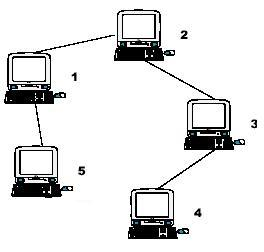

## Computer

### Description
A school bought the first computer some time ago(so this computer's id is 1). During the recent years the school bought N-1 new computers. Each new computer was connected to one of settled earlier. Managers of school are anxious about slow functioning of the net and want to know the maximum distance Si for which i-th computer needs to send signal (i.e. length of cable to the most distant computer). You need to provide this information.   


### Hint
the example input is corresponding to this graph. And from the graph, you can see that the computer 4 is farthest one from 1, so S1 = 3. Computer 4 and 5 are the farthest ones from 2, so S2 = 2. Computer 5 is the farthest one from 3, so S3 = 3. we also get S4 = 4, S5 = 4.

### Input
Input file contains multiple test cases.In each case there is natural number N (N<=10000) in the first line, followed by (N-1) lines with descriptions of computers. i-th line contains two natural numbers - number of computer, to which i-th computer is connected and length of cable used for connection. Total length of cable does not exceed 10^9. Numbers in lines of input are separated by a space.

### Output
For each case output N lines. i-th line must contain number Si for i-th computer (1<=i<=N).

### Sample Input
5  
1 1  
2 1  
3 1  
1 1  

### Sample Output
3  
2  
3  
4  
4  

### 问题分析
* 这道题需要先知道两个概念
> 1. 树上最大的距离是树的直径。
> 1. 距离树上每个节点距离最大的点，一定在树的直径上。

1. 通过一次 dfs 求出直径上的一个端点 root1。
1. 以 root1 为端点，再进行一次 dfs，找到直径上另一个端点 root2，在此过程中，记录 root1 到各点的距离，dist1。
1. 以 root2 为端点，进行 dfs，记录 root2 到各点的距离 dist2。
1. 因为树上一点，到距离它最远到点，一定在直径上，所以 `max(dist1[i], dist2[i])` 就是问题的答案。

### 错误记录
1. 第一次想的是，对树上每一个点进行一次 dfs，找到距离最远的点，结果由于时间复杂度是 O(n)，所以超时了。

### Code
```cpp
#include<cstdio>
#include<cstring>
#include<algorithm>

using namespace std;

const int MAX = 1e4+5;

int head[MAX];
int dis[MAX];
int dist1[MAX];
int dist2[MAX];
int tot = 0;
struct Edge {
    int to, w, next;
} edge[MAX<<1];

void init() {
    tot = 0;
    memset(head, -1, sizeof(head));
    memset(dis, 0, sizeof(dis));
    memset(dist1, 0, sizeof(dist1));
    memset(dist2, 0, sizeof(dist2));
}

void add(int u, int v, int w) {
    edge[tot].to = v;
    edge[tot].w  = w;
    edge[tot].next = head[u];
    head[u] = tot++;
}

void dfs(int u, int parent) {
    for (int i = head[u]; -1 != i; i = edge[i].next) {
        int v = edge[i].to;
        if (v == parent) {
            continue;
        }
        dis[v] = dis[u] + edge[i].w;
        dfs(v, u);
    }
}

void dfs1(int u, int parent) {
    for (int i = head[u]; -1 != i; i = edge[i].next) {
        int v = edge[i].to;
        if (v == parent) {
            continue;
        }
        dist1[v] = dist1[u] + edge[i].w;
        dfs1(v, u);
    }
}

void dfs2(int u, int parent) {
    for (int i = head[u]; -1 != i; i = edge[i].next) {
        int v = edge[i].to;
        if (v == parent) {
            continue;
        }
        dist2[v] = dist2[u] + edge[i].w;
        dfs2(v, u);
    }
}
int main() {
    int size;
    while (~scanf("%d", &size)) {
        int v, w;
        init();
        for (int i = 2; i <= size; i++) {
            scanf("%d %d", &v, &w);
            add(i, v, w);
            add(v, i, w);
        }

        dfs(1, -1);
        int tmp = 0, root1 = 0;
        for (int i = 1; i <= size; i++) {
            if (dis[i] > tmp) {
                root1 = i;
                tmp = dis[i];
            }
        }

        dfs1(root1, -1);
        int d = 0, root2 = 0;
        for (int i = 1; i <= size; i++) {
            if (dist1[i] > d) {
                d = dist1[i];
                root2 = i;
            }
        }

        dfs2(root2, -1);

        for (int i = 1; i <= size; i++) {
            printf("%d\n", max(dist1[i], dist2[i]));
        }
    }
    return 0;
}
```

##### Go 语言版本
```go
package main

import "fmt"

const MAX = 1e4+5

type Edge struct {
    to, w, next int
}

var (
    head [MAX]int
    dis  [MAX]int
    dis1 [MAX]int
    dis2 [MAX]int
    edge [MAX<<1]Edge
    tot  int
)

func memset(arr []int, v int) {
    for key := range arr {
        arr[key] = v
    }
}

func max(a, b int) int {
    if a > b {
        return a
    }
    return b
}

func add(u, v, w int) {
    edge[tot].to = v
    edge[tot].w  = w
    edge[tot].next = head[u]
    head[u] = tot
    tot++
}

func dfs(u, p int) {
    for i := head[u]; i != -1; i = edge[i].next {
        v := edge[i].to
        if v ==p {
            continue
        }
        dis[v] = dis[u] + edge[i].w
        dfs(v, u)
    }
}

func dfs1(u, p int) {
    for i := head[u]; i != -1; i = edge[i].next {
        v := edge[i].to
        if v ==p {
            continue
        }
        dis1[v] = dis1[u] + edge[i].w
        dfs1(v, u)
    }
}

func dfs2(u, p int) {
    for i := head[u]; i != -1; i = edge[i].next {
        v := edge[i].to
        if v ==p {
            continue
        }
        dis2[v] = dis2[u] + edge[i].w
        dfs2(v, u)
    }
}

func main() {
    var n int
    for {
        if _, err := fmt.Scanf("%d\n", &n); err != nil {
            break
        }
        memset(head[:], -1)
        memset(dis[:], 0)
        memset(dis1[:], 0)
        memset(dis2[:], 0)
        var v, w int
        for u := 2; u <= n; u++ {
            fmt.Scanf("%d %d\n", &v, &w)
            add(u, v, w)
            add(v, u, w)
        }

        dfs(1, -1)
        var node, tmp int
        for i := 1; i <= n; i++ {
            if dis[i] > tmp {
                tmp = dis[i]
                node = i
            }
        }

        dfs1(node, -1)
        node, tmp = 0, 0
        for i := 1; i <= n; i++ {
            if dis1[i] > tmp {
                tmp = dis[i]
                node = i
            }
        }

        dfs2(node, -1)

        for i := 1; i <= n; i++ {
            fmt.Println(max(dis1[i], dis2[i]))
        }
    }
}
```