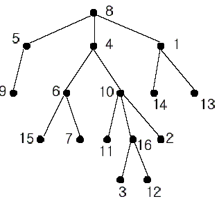

## Nearest Common Ancestors
> POJ - 1330

### Deescrption
A rooted tree is a well-known data structure in computer science and engineering. An example is shown below: 

 
In the figure, each node is labeled with an integer from {1, 2,...,16}. Node 8 is the root of the tree. Node x is an ancestor of node y if node x is in the path between the root and node y. For example, node 4 is an ancestor of node 16. Node 10 is also an ancestor of node 16. As a matter of fact, nodes 8, 4, 10, and 16 are the ancestors of node 16. Remember that a node is an ancestor of itself. Nodes 8, 4, 6, and 7 are the ancestors of node 7. A node x is called a common ancestor of two different nodes y and z if node x is an ancestor of node y and an ancestor of node z. Thus, nodes 8 and 4 are the common ancestors of nodes 16 and 7. A node x is called the nearest common ancestor of nodes y and z if x is a common ancestor of y and z and nearest to y and z among their common ancestors. Hence, the nearest common ancestor of nodes 16 and 7 is node 4. Node 4 is nearer to nodes 16 and 7 than node 8 is. 

For other examples, the nearest common ancestor of nodes 2 and 3 is node 10, the nearest common ancestor of nodes 6 and 13 is node 8, and the nearest common ancestor of nodes 4 and 12 is node 4. In the last example, if y is an ancestor of z, then the nearest common ancestor of y and z is y. 

Write a program that finds the nearest common ancestor of two distinct nodes in a tree. 

### Input
The input consists of T test cases. The number of test cases (T) is given in the first line of the input file. Each test case starts with a line containing an integer N , the number of nodes in a tree, 2<=N<=10,000. The nodes are labeled with integers 1, 2,..., N. Each of the next N -1 lines contains a pair of integers that represent an edge --the first integer is the parent node of the second integer. Note that a tree with N nodes has exactly N - 1 edges. The last line of each test case contains two distinct integers whose nearest common ancestor is to be computed.

### Output
Print exactly one line for each test case. The line should contain the integer that is the nearest common ancestor.

### Sample Input
2  
16  
1 14  
8 5   
10 16  
5 9  
4 6  
8 4  
4 10  
1 13  
6 15  
10 11  
6 7  
10 2  
16 3  
8 1  
16 12  
16 7  
5  
2 3  
3 4  
3 1  
1 5  
3 5  

### Sample Output
4  
3  

### 问题分析
* 基本是 lca 的裸题，唯一需要注意的是，题目没有给出树的根节点，需要先找到根节点。

### Code
```cpp
#include<cstdio>
#include<algorithm>
#include<cstring>

using namespace std;

const int MAX = 1e4+5;

int head[MAX];
struct Edge {
    int to, w, next;
} edge[MAX<<1];
int size[MAX];
int tot = 0;
int n = 0;
int top[MAX], dep[MAX], fa[MAX], son[MAX], vis[MAX];

void init() {
    memset(head, -1, sizeof(head));
    memset(vis, 0, sizeof(vis));
    tot = 0;
}

void add(int u, int v, int w) {
    edge[tot].to = v;
    edge[tot].w  = w;
    edge[tot].next = head[u];
    head[u] = tot++;
}

void dfs1(int u, int parent, int depth) {
    dep[u]  = depth;
    size[u] = 1;
    fa[u]   = parent;
    son[u]  = -1;
    for (int i = head[u]; -1 != i; i = edge[i].next) {
        int v = edge[i].to;
        if (v == parent) {
            continue;
        }
        dfs1(v, u, depth+1);
        size[u] += size[v];
        if (-1 == son[u] || size[v] > size[son[u]]) {
            son[u] = v;
        }
    }
}

void dfs2(int u, int tp) {
    top[u] = tp;
    if (son[u] == -1) {
        return;
    }
    dfs2(son[u], tp);
    for (int i = head[u]; -1 != i; i = edge[i].next) {
        int v = edge[i].to;
        if (v != son[u] && v != fa[u]) {
            dfs2(v, v);
        }
    }
}

int lca(int x, int y) {
    while(top[x] != top[y]) {
        if (dep[top[x]] > dep[top[y]]) {
            x = fa[top[x]];
        } else {
            y = fa[top[y]];
        }
    }
    return dep[x] > dep[y] ? y : x;
}

int main() {
    int T;
    scanf("%d", &T);
    while(T--) {
        init();
        int num;
        scanf("%d", &num);
        int x, y;
        for (int i = 1; i < num; i++) {
            scanf("%d %d", &x, &y);               
            vis[y] = 1;
            add(x, y, 1);
            add(y, x, 1);
        }
        
        int root = 0;
        for (int i = 1; i <= num; i++) {
            if (!vis[i]) {
                root = i; 
            }
        }
        dfs1(root, -1, 1);
        dfs2(root, 1);


        scanf("%d %d", &x, &y);
        printf("%d\n", lca(x, y));
    }
    return 0;
}
```